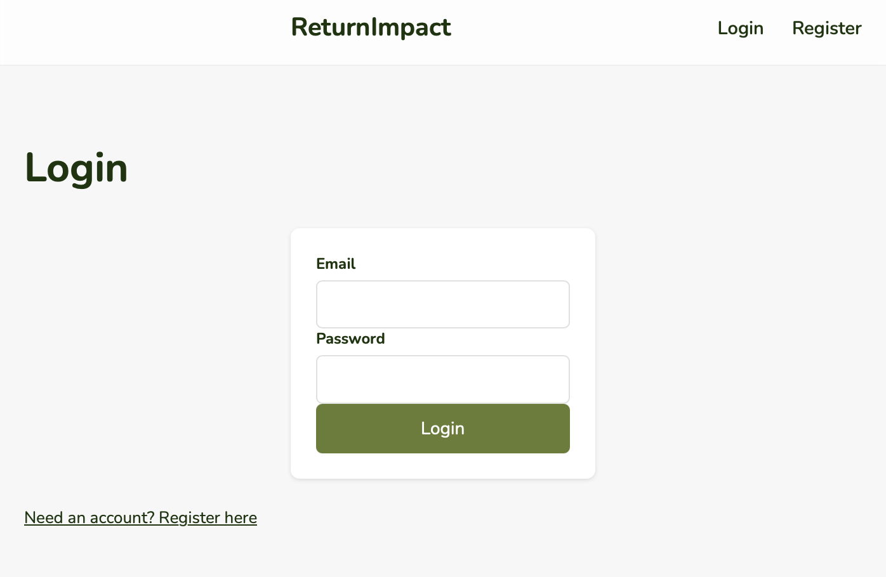
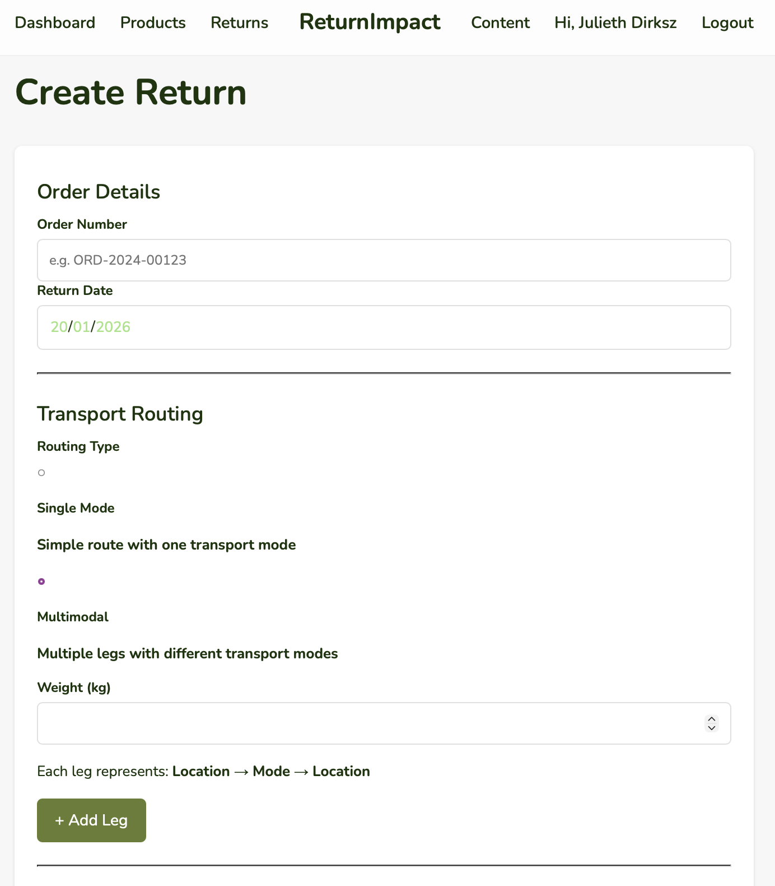
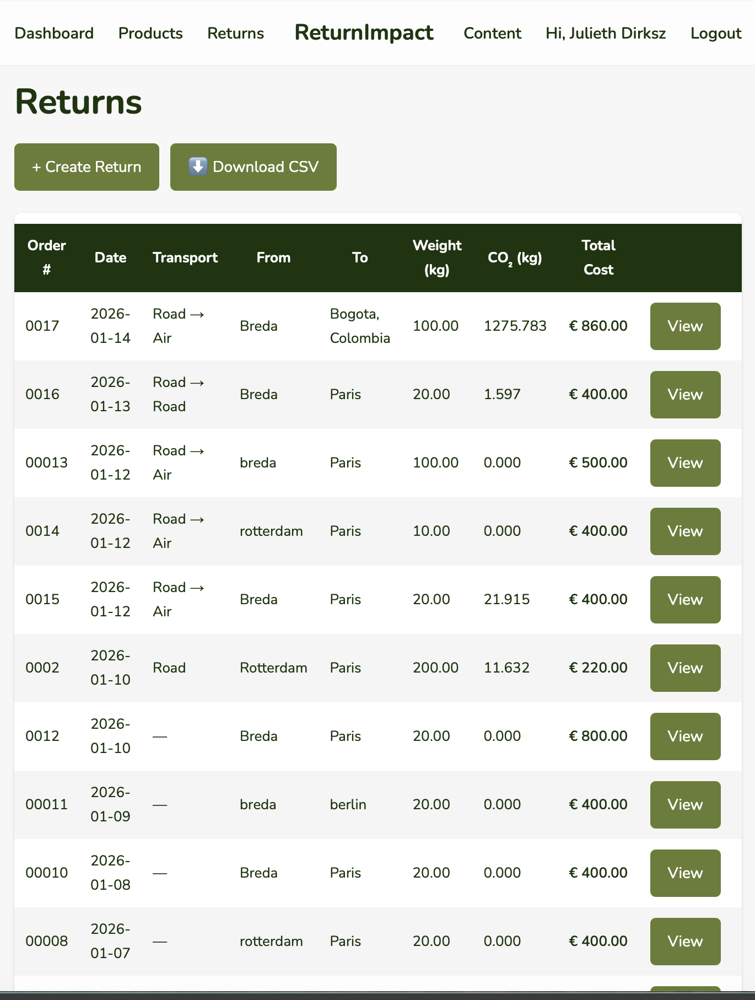
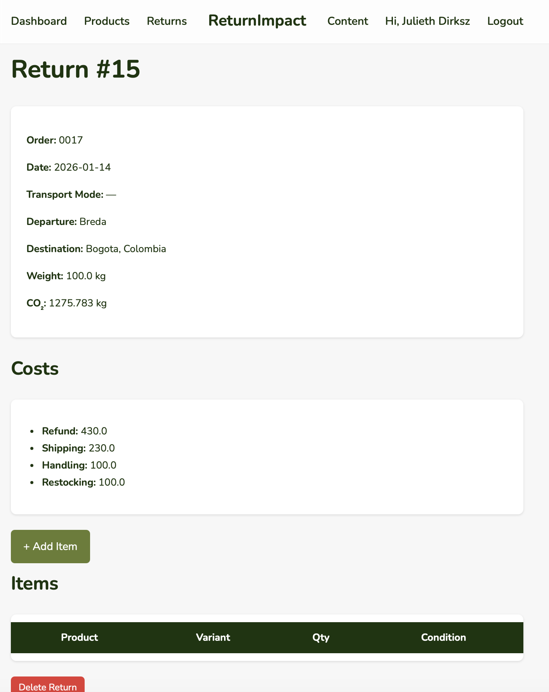
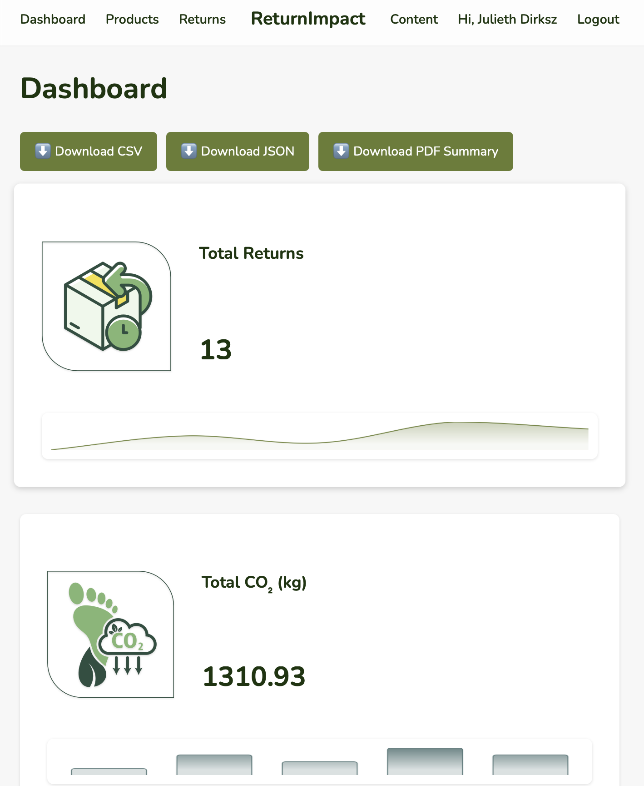

# ReturnImpact – V1.0 (Final Academic Release)
*A multimodal CO₂ and cost analytics tool for product returns*

---

## Description

ReturnImpact is a web‑based application developed as the final project for:

**Creative Programming for Non‑IT — Module Webdesign**  
**NHL Stenden Hogeschool, Leeuwarden**

This project was completed as part of my **minor** during my Bachelor studies and integrates concepts learned in:

- CS50x — Introduction to Computer Science (Harvard University)  
- Minor in Computer Science (BUas)

ReturnImpact helps companies track product returns and understand both the **financial cost** and **environmental (CO₂) impact** associated with reverse logistics.  
The system is designed as a **multi‑company (multi‑tenant)** platform where each company manages its own data securely after logging in.

---

## Project Goals

- Enable companies to log and manage product returns  
- Track financial costs associated with returns  
- Estimate CO₂ emissions using the **Climatiq Intermodal Freight API v3**  
- Support **single‑mode** and **multimodal** transport modeling  
- Provide a clean, accessible interface for logistics workflows  
- Demonstrate full‑stack development skills learned during CS50 and the Minor  

---

## Key Features

### Authentication & Multi‑Company Support
- Company login  
- Role‑based access (admin, manager, viewer)  
- Secure session handling  

### Return Management
- Create, view, list, and delete returns  
- Add return items with product + variant selection  
- Store weight, costs, notes, timestamps  

### CO₂ Emissions Calculation
- **Single‑mode CO₂ calculation** (road, air, sea, rail)  
- **Multimodal CO₂ calculation with unlimited legs**  
- Dynamic route builder using JavaScript  
- Client‑side validation  
- Automatic routing + tolerance_km  
- Robust error handling with fallback  

### Data & Export
- CSV export for the returns list  
- Leg summary displayed directly in the table  
- SQLite relational database  

### User Interface
- Clean design system (cards, tables, buttons)  
- Accessible form structure (WCAG‑aligned labels)  
- Flash messages for feedback  
- Jinja2 templating  

### Architecture
- Modular Flask blueprints  
- Shared API helper for Climatiq  
- Academic documentation throughout the code  

---

## Database Design

The system uses a normalized SQLite schema with the following entities:

- **companies** – multi‑tenant separation  
- **users** – authentication + roles  
- **products** and **product_variants**  
- **returns** – core return records  
- **return_items** – items linked to each return  
- **transport_modes** – name + api_value for Climatiq  

The schema supports both single‑mode and multimodal routing without modification.

---

## Screenshots 

These screenshots demonstrate the core functionality required for evaluation.

### Login Page 

### Create Return — Multimodal Route Builder  

### Returns List (with leg summary + CSV export)  

### Return Detail Page  

### Dashboard 

---

## How to Run the Project Locally

This project includes a `.env` file located at:
`returnImpact/.env`

The `.env` file contains the **Climatiq API key** required for CO₂ calculations.  
This key is included **only for academic evaluation** as part of this minor project.

### 1. Install dependencies  
`pip install -r requirements.txt`

### 2. Ensure the `.env` file is present  
It must contain:
`CLIMATIQ_API_KEY=your_key_here`

### 3. Initialize the database  
`flask --app returnImpact.app  init-db`

### 4. Run the application  
`flask run`

The app will be available at:  
**http://127.0.0.1:5000**

---

## Submission Instructions (for Grading)

These steps follow the exact requirements from the teacher:

1. **Remove** the following directories everywhere in the project:
   - `venv/`
   - `__pycache__/`

2. **Add** a `requirements.txt` file containing only the necessary libraries.

3. **ZIP** the entire project into **one single ZIP file**.

4. **Upload** the ZIP file to the submission portal.  
   If the ZIP is too large, send it via WeTransfer to:  
   **cpnits@nhlstenden.com**

5. Ensure the ZIP contains:
   - All source code  
   - Templates  
   - Static files  
   - README.md  
   - requirements.txt  
   - `.env` file with the API key  
   - Screenshots folder (optional but recommended)

Uploads that do not follow these rules **will not be graded**.

---

## References

- **Climatiq Intermodal Freight API v3**  
  https://www.climatiq.io/docs/api-reference/intermodal-freight/intermodal-freight-v3  

- **Flask Documentation**  
  https://flask.palletsprojects.com  

- **SQLite Documentation**  
  https://www.sqlite.org/docs.html  

- **MDN Web Docs – HTML, Forms, JavaScript**  
  https://developer.mozilla.org  

- **OECD – Multimodal Transport Concepts**  
  https://www.oecd.org/cfe/regionaldevelopment/transport.htm  

- **CS50 SQL & Flask Patterns**  
  https://cs50.harvard.edu  

---

## License

**All Rights Reserved — Academic Use Only**

This project is intended solely for educational purposes within:

- Creative Programming for Non‑IT (Webdesign module) — NHL Stenden  
- CS50 final project requirements   

The included Climatiq API key is a **student account**, limited to **500 requests until April 1**, and may only be used for academic evaluation by instructors.

---

## Acknowledgements

- NHL Stenden Hogeschool — Creative Programming for Non‑IT  
- Breda University of Applied Sciences — Minor in Logistics Engineering
- Harvard CS50  
- Climatiq for providing academic API access  

